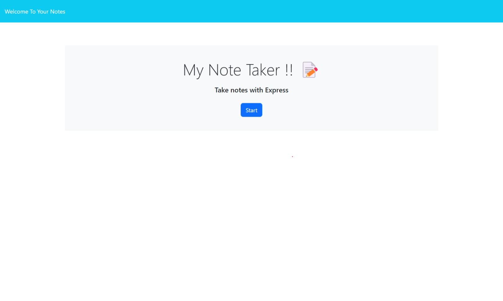
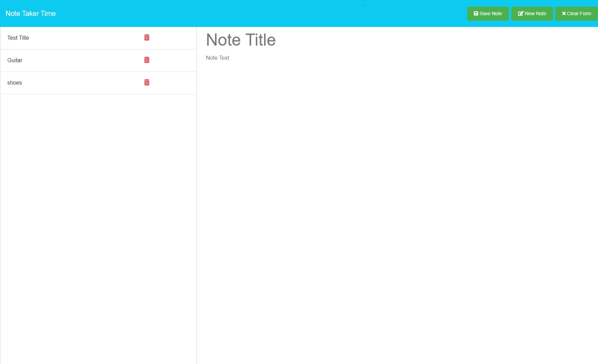

# My Note Taker (Module 11)

## Description 
Welcome to the Note Taker application! This tool helps you write, save, and organize your notes efficiently. Built using Express.js for the back end, it allows users to create, store, and delete notes seamlessly. When you open the application, you see the start page that says My Note Taker!! Then when you click 'Start' you can view existing notes on the left side of the screen while entering new ones on the right. A "Save Note" button allows you to store your notes, and a "Clear Form" button lets you reset the input fields. Saved notes remain listed on the left for easy access, and clicking a note loads it back into the editor. You can also delete notes you no longer need.
This simple yet powerful application ensures you never lose track of important thoughts or tasks! 

## Acceptance Criteria

GIVEN a note-taking application

WHEN I open the Note Taker

THEN I am presented with a landing page with a link to a notes page

WHEN I click on the link to the notes page

THEN I am presented with a page with existing notes listed in the left-hand column, plus empty fields to enter a new note
\ title and the note’s text in the right-hand column

WHEN I enter a new note title and the note’s text

THEN a "Save Note" button and a "Clear Form" button appear in the navigation at the top of the page

WHEN I click on the Save button

THEN the new note I have entered is saved and appears in the left-hand column with the other existing notes and the buttons in the navigation disappear

WHEN I click on an existing note in the list in the left-hand column

THEN that note appears in the right-hand column and a "New Note" button appears in the navigation

WHEN I click on the "New Note" button in the navigation at the top of the page

THEN I am presented with empty fields to enter a new note title and the note’s text in the right-hand column and the button disappears

## Installation

1. Create a GitHub repository.
2. Name it " My Note Taker (Module 11)".
3. Clone it to your desktop.
4. Open it in VS Code.
5. Run npm init -y to generate package.json.
6. Install dependencies by running npm i .
7. Set up the server in server.js.
8. Create API routes for handling notes in routes/notes.js.
9. Create db.json to store notes data.
10. Implement the front-end for the landing page and notes page.
11. Add functionality for saving and displaying notes.
12. Create the README.md with installation and usage instructions.
13. Test the app and push to GitHub.

* Here is a photo of how it looks 

